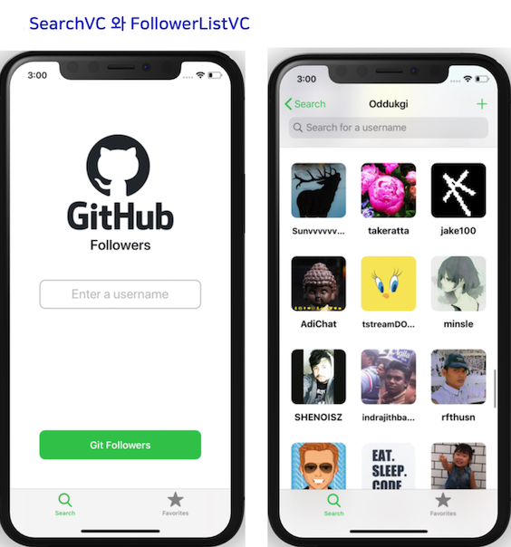
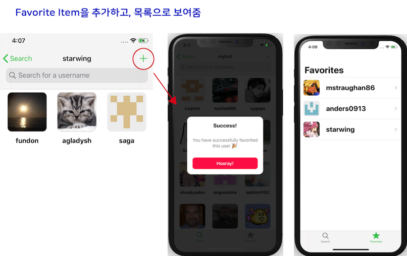

#  GHFollowers
This app shows github followers list and follower information

## Tech Stack
- code based UI
- cocoa pods :   SwiftyJSON, SwiftSoup

## Features
1. Show follower list and follower information
2. Filter follower list with keyword
3. Add follower in favorite list
4. Show contribution calendar in UserInfoVC

## Simulation Video
[Video](https://drive.google.com/file/d/1QdN1hpa7AjoqK0A2PhPcoChR_Uotuk__/view?usp=sharing)

## Screenshot

\

